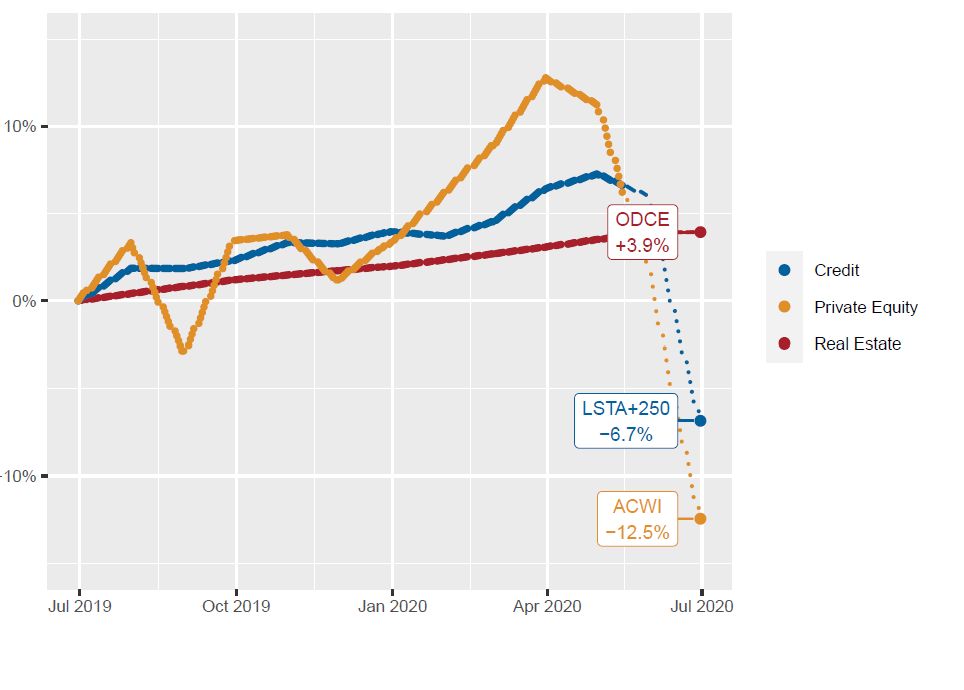
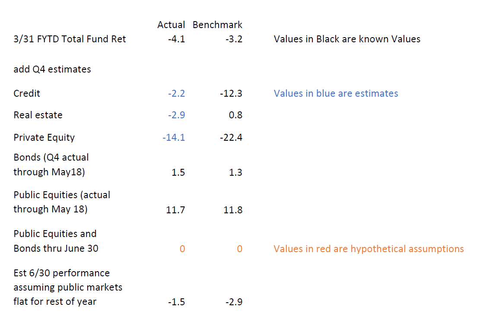

```{r setup, include=FALSE}
knitr::opts_chunk$set(echo = FALSE)
```
## instructions for using these slides (this slide is not part of the presentaion)

there are 8 slides here to include in the deck at the places indicated

I want to delete in its entirety subsection 2 in the FYTD section (total fund attribution).  I also want to delete in its entirety subsection 3 in the FYTD section (equity decomposition).  This deletes slides 6 through 14 in the draft deck you have provided me.


## this slide is not part of the presentation

but the next two slides are.  please position them after slide 4 "total fund fiscal year to date through 5/18/2018"

## Private Markets Benchmark Returns

Are lagged 90 days and are already known through the end of the fiscal year.  Actual private market returns are booked when received for the whole quarter, while the benchmarks rose in the first half of the quarter but declined precipitously in the third month of the quarter.

{fig.height=2}

## Estimating June 30 returns from available information



## this slide is not part of the presenation

please position the remaining 6 slides after slide "total fund current positioning"

## Stock market valuation

- Stock market prices are determined in a competitive market by self interested traders 
- A good way to understand valuation is through the PE ratio which is simply the price divided by earnings
- The stock market can go up because of a higher PE ratio or higher earnings or a mix
- Traders can agree on the price even if they disagree on the reasoning


## What Causes PE to go up?

- Low Interest Rates
- High growth
- Low risk perception
- Capital Flows 

PE Ratios will spike during a recession because of a temporary decline in earnings and anticipated recovery

## PE History

```{r, warning=FALSE, message=FALSE}
library(ggplot2)
x=read.csv("multpl-sp500_pe_ratio_month.csv")
x$Date=as.Date(x$Date,format="%Y-%m-%d")
x=x[x$Date>as.Date("1990-1-1"),]
ggplot(x,aes(x=Date,y=Value))+ylim(10,60)+geom_line()+ylab("PE Ratio")+geom_smooth()
```


## What causes earnings to go up?

- Economic growth
- Low interest rates
- Low taxes
- Strong household finance (economy is 70% consumer)
- Competitive labor and supply chain markets 
- Open markets 
- Positive business environment (rule of law, property rights, limited regulation)
- Technology and productivity

## Earnings per share history

```{r, message=FALSE, warning=FALSE}
x=read.csv("multpl-sp500_earnings_month.csv")
x$Date=as.Date(x$Date,format="%Y-%m-%d")
x=x[x$Date>as.Date("1990-1-1"),]
ggplot(x,aes(x=Date,y=Value))+geom_line()+
  ylab("Earnings Per Share")+geom_smooth()

```

## Stock market value as function of PE and Earnings
```{r}
library(tidyr)
library(ggplot2)
library(stringr)
pe_multiplier=seq(15,30,1)
#eps2750=2750/pe_multiplier
#eps2500=2500/pe_multiplier
eps2300=2300/pe_multiplier
#eps2000=2000/pe_multiplier
eps2900=2900/pe_multiplier
#eps3250=3250/pe_multiplier
eps3500=3500/pe_multiplier
cm=data.frame(pe_multiplier,eps2300,eps2900,eps3500)
cmlong=gather(cm,"SP500","Earnings_per_share",-pe_multiplier)
cmlong$SP500=str_sub(cmlong$SP500,4)
ggplot(cmlong,aes(y=Earnings_per_share,x=pe_multiplier,group=SP500,color=SP500))+geom_line()
```

## no more slides